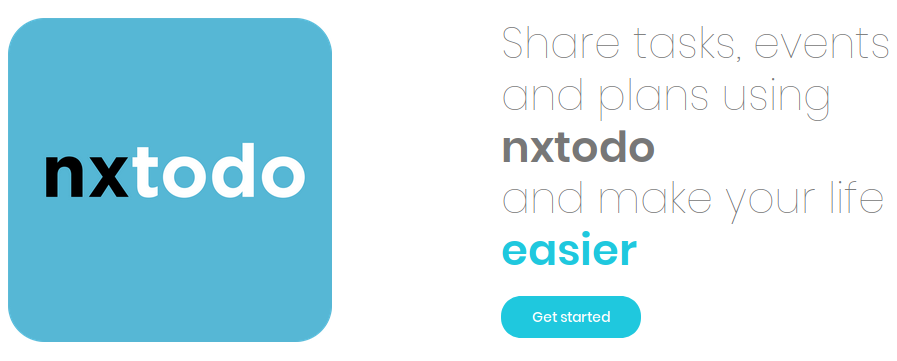
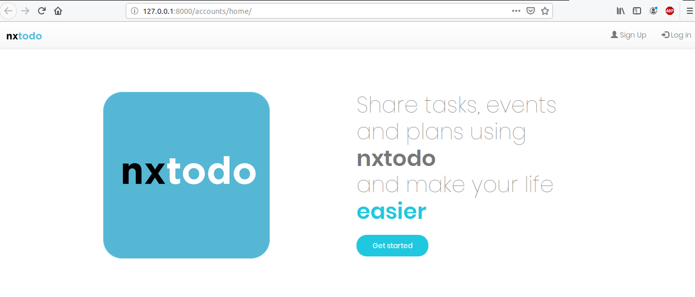
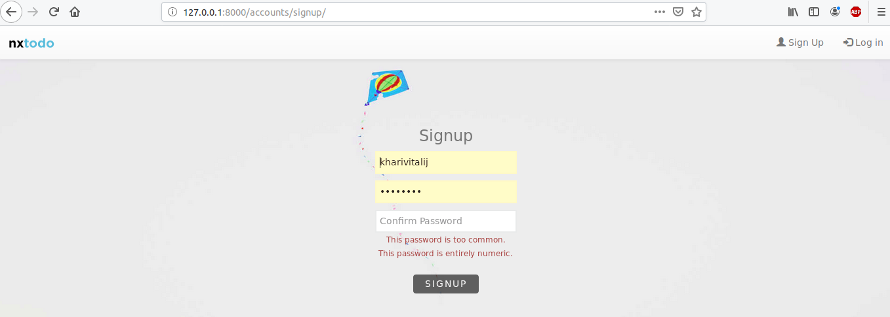
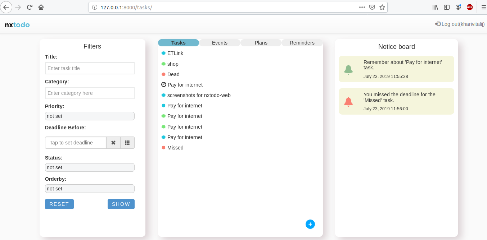
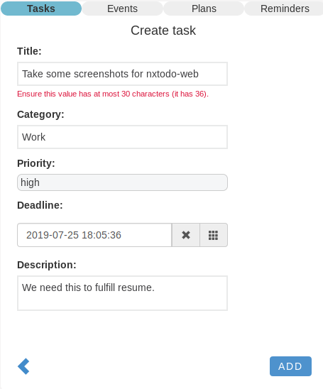
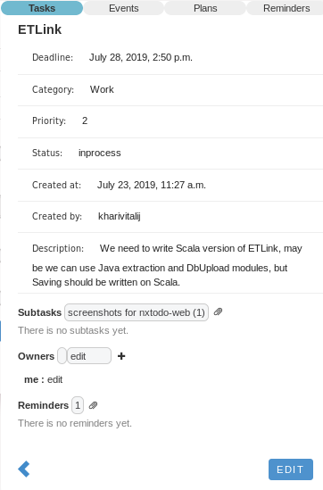
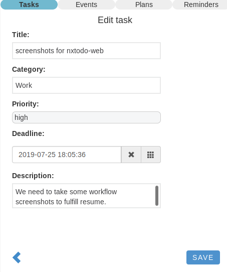
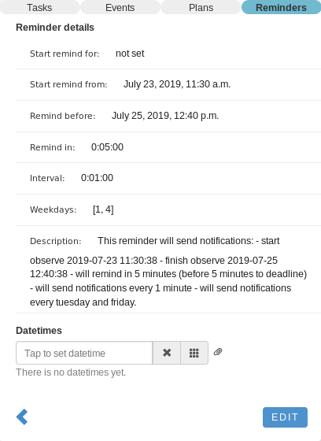
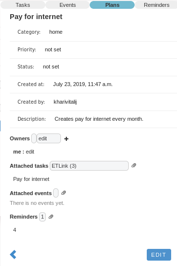
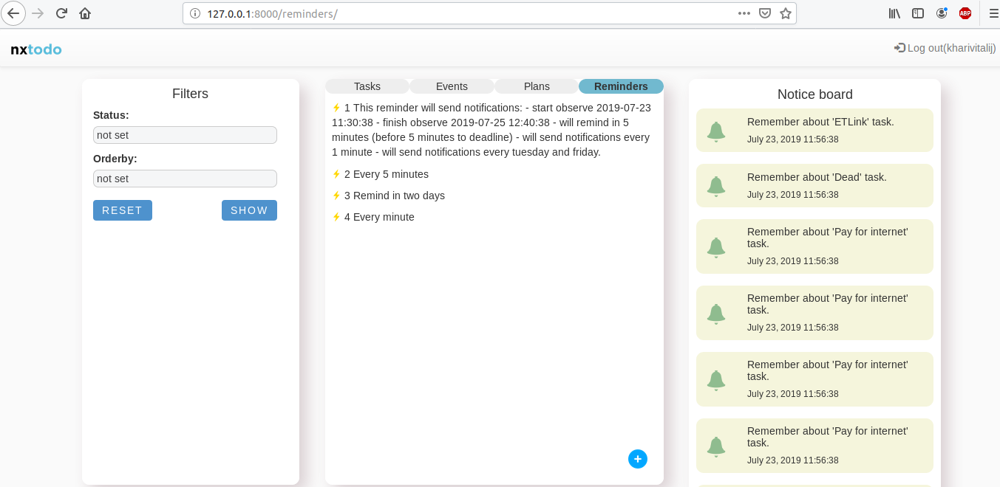

# nxtodo
Users, tasks, events, plans, reminders - store and manage them as you want.



# Table of Contents
* [nxtodo (lib)](#nxtodo-lib)
    * [Getting started](#getting-started)
    * [Simple examples](#simple-examples)
    * [Running the tests](#running-the-tests)
* [nxtodo (cli)](#nxtodo-cli)
    * [How to install?](#how-to-install)
    * [Customize nxtodo](#customize-nxtodo)
    * [How it works?](#how-it-works)
    * [Simple work session](#simple-work-session)
* [nxtodo (web)](#nxtodo-web)
    * [How to run?](#how-to-run)
    * [Some examples](#some-examples)

# nxtodo (lib)
nxtodo - is a simple python library that will allow you to create applications
like todos. Users, tasks, events, plans, reminders - store them in the
database and manage them as you want.
## Getting started
nxtodo depends on a [PostgreSQL](https://www.postgresql.org/), open source 
object-relational database. Please, install it before using nxtodo:

For ubuntu:
```
$ sudo apt-get update
$ sudo apt-get install postgresql postgresql-contrib libpq-dev
``` 
### Installing
Clone this repository:
```
$ git clone https://github.com/Mikita-Kharitonau/nx_todo.git
```
Create and activate virtual environment, e. g. [virtualenv](https://virtualenv.pypa.io/en/stable/installation/):
```
$ cd nx_todo
$ virtualenv venv
$ source venv/bin/activate
```
Create a source distribution, and then install using [pip](https://pip.pypa.io/en/stable/):
```
$ cd nxtodo-lib
$ python3 setup.py sdist
$ pip3 install ./dist/nxtodo-1.0.tar.gz
```
### Initializing
After downloading and installing PostgreSQL, you should initialize the nxtodo:

For default:
```python
>> import nxtodo
>> nxtodo.initialize()
```
For a more advanced configuration, use function with arguments:
```python
>> nxtodo.initialize(
        psql_user='nxtodo',
        psql_password='todotodo',
        psql_db_name='nxtodo',
        settings_module='nxtodo.configuration.settings'
   )
```      
\**settings_module* - is a django [settings](https://docs.djangoproject.com/en/1.11/ref/settings/) module:
### Configuration
If you want to use **already existing** database, you should only configure nxtodo:
```python
>> nxtodo.configure()
```
or
```python
>> nxtodo.configure('your_settings_module')
```
## Simple examples
Here you can find some simple examples to get you started.
```python
>> import nxtodo
>> nxtodo.configure()
>> from nxtodo import queries
```
### Adding task
```python
>> queries.add_task(executor='creator', title='simple_task')
```
### Task with owners
```python
>> from nxtodo.thirdparty import Owner, AccessLevels
>> owners = [
    Owner('user_1', AccessLevels.EDIT.value),
    Owner('user_2', AccessLevels.READONLY.value)
  ]
>> queries.add_task(executor='creator', title='task_with_owners', owners=owners)
```
\* *note, that owners 'user_1' and 'user_2' must be existing nxtodo users.*
### Getting tasks of user 'user_1'
```python
>> queries.get_tasks(user='user_1')
<QuerySet [<Task: task_1>]>
```
And some filters:
```python
>> queries.get_tasks(user='user_1', category='sport', priority=2)
<QuerySet [<Task: do_exercises>]>
```
### Adding subtasks
```python
>> queries.add_subtasks(user_name='user_1', task_id=to_task, subtasks_ids=[subtask1, subtask2 ...])
```
### Create a reminder for 'user_1', which can remind in a week before deadline with a periodicity of one day and also remind 2018/06/07 at 17:00:00
```python
>> queries.add_reminder(
    user='user_1',
    start_remind_before=timedelta(weeks=1),
    datetimes=[datetime(2018, 6, 7, 17)],
    interval=timedelta(hours=1)
  )
>> queries.add_reminders_to_task(user_name='user_1', task_id=task_1_id, [reminder_1, ...])
```
And this same reminder to another task:
```
>> queries.add_reminders_to_task('user_1', task_2_id, [reminder_1, ...])
```
### Getting notification from tasks, events
```python
>> queries.get_tasks_notifications(user='user_1')
>> queries.get_events_notifications(user='user_1')
```
### And a bit more interesting:
Create a plan by 'user_1', which will create common for users 'user_2'
    and 'user_3' task 'task_1' and event 'event_1' from 2018/06/10 10:00
    to 2018/07/20 20:30 with a periodicity of 8 hours, and on weekends.
```python
>> queries.add_reminder(
    user='user_1',
    start_remind_from=datetime(2018, 6, 10, 10),
    stop_remind_in=datetime(2018, 7, 20, 20, 30),
    interval=timedelta(hours=8),
    weekdays=[5, 6]
  )
>> queries.add_plan(
    executor='user_1',
    title='interesting_plan',
    tasks=[task_1, ...],
    events=[event_1, ...],
    owners=[
       Owner('user_1', 'edit'),
       Owner('user_1', 'edit')
    ],
    reminders=[reminder_1, ...]
  )
>> queries.check_plans(user='user_2')
```
## Running the tests
First, you need to initialize the database for tests:
```
$ python3
```
```python
>> import nxtodo
>> nxtodo.initialize(settings_module=nxtodo.configuration.settings_for_tests)
```
Run all tests for nxtodo:
```
$ python -m unittest discover nxtodo/nxtodo-lib/nxtodo/tests/ -v
```
# nxtodo (cli)
nxtodo_cli - is a console client for nxtodo library.
## How to install?
First of all, you need to have [nxtodo (lib)](#nxtodo-lib) installed and properly initialized on your machine:
```
>> import nxtodo
>> nxtodo.initialize(psql_db_name='nxtodo_cli')
```
Clone this repository:
```
$ git clone https://github.com/Mikita-Kharitonau/nx_todo.git
```
Create (or activate, if created) virtual environment, e. g. [virtualenv](https://virtualenv.pypa.io/en/stable/installation/):
```
$ cd nx_todo
$ virtualenv venv
$ source venv/bin/activate
```
Create a source distribution, and then install using [pip](https://pip.pypa.io/en/stable/):
```
$ cd nxtodo-cli
$ python3 setup.py sdist
$ pip3 install ./dist/nxtodo_cli-1.0.tar.gz
```
## Customize nxtodo
After installing nxtodo_cli you can find '.nxtodo' folder in your home catalog. This folder contains 
the **config file.** For example, you can set your colors for display, set the current user and some other parameters.
## How it works?
Each command has two parts and additional arguments:
```
$ nxtodo <entity> <action> <additional_arguments>
```
#### For example:
##### Add user 
```
$ nxtodo user add -n username
```
##### Create task 'simple task' with deadline 2018/07/10 10:00:00
```
$ nxtodo task add -t 'simple task' -D '2018/07/10 10:00:00'
```
##### Show tasks with category 'sport' and priority '1'
```
$ nxtodo task show -c sport -p 1
```
## Simple work session
Creating users:
```commandline
$ nxtodo user add -n nikita
nikita
$ nxtodo user add -n milana
milana
$ nxtodo user add -n yura
yura
```
Adding some tasks:
```commandline
$ nxtodo task add -t 'simple task' -D 'description for task' -d '2018/06/20 10:00:00'
6
$ nxtodo task add -t 'task_1' -c 'sport' -p 2
7
$ nxtodo task add -t 'shared_task'
8
```
Lets share nikita's task 'shared_task' to 'milana' and 'yura':
```commandline
$ nxtodo task share -i 8 -o 'milana edit' 'yura readonly'
```
And try edit it:
```commandline
$ nxtodo task edit -i 8 -t 'new title' -u yura
Permission denied, you can't edit '8' task.
$ nxtodo task edit -i 8 -t 'new title' -u milana
$ nxtodo task  show
      June          July           August     
Mon    18 25     2  9 16 23 30     6 13 20 27 
Tue    19 26     3 10 17 24 31     7 14 21 28 
Wed    20 27     4 11 18 25     1  8 15 22 29 
Thu    21 28     5 12 19 26     2  9 16 23 30 
Fri    22 29     6 13 20 27     3 10 17 24 31 
Sat 16 23 30     7 14 21 28     4 11 18 25    
Sun 17 24     1  8 15 22 29     5 12 19 26    
---------------------------------------------------------------------------------------------------------------------------------------
| id |    title    | description |   status  |       deadline      |      created_at     | created_by | reminders | subtasks | owners |
---------------------------------------------------------------------------------------------------------------------------------------
| 6  | simple task |  descriptio | inprocess | 2018-06-20 10:00:00 | 2018/06/16 12:37:04 |   nikita   |    None   |   None   | nikita |
|    |             |  n for task |           |                     |                     |            |           |          |        |
| 7  |    task_1   |     None    | inprocess |         None        | 2018/06/16 12:40:33 |   nikita   |    None   |   None   | nikita |
| 8  |  new title  |     None    | inprocess |         None        | 2018/06/16 12:46:50 |   nikita   |    None   |   None   | nikita |
|    |             |             |           |                     |                     |            |           |          | milana |
|    |             |             |           |                     |                     |            |           |          |  yura  |
---------------------------------------------------------------------------------------------------------------------------------------
```
\* you may notice that milana changed the title, but yura could not.

Create a reminder:
```commandline
$ nxtodo reminder add  -I 0:0:0:1
1
```
It will show notifications for 'simple task' every minute:
```commandline
$ nxtodo reminder totask -i 1 -t 6
```
>Notice, that you may see tasks reminders, subtasks, owners in the table:
```commandline
$ nxtodo task show
      June          July           August
Mon    18 25     2  9 16 23 30     6 13 20 27
Tue    19 26     3 10 17 24 31     7 14 21 28
Wed    20 27     4 11 18 25     1  8 15 22 29
Thu    21 28     5 12 19 26     2  9 16 23 30
Fri    22 29     6 13 20 27     3 10 17 24 31
Sat 16 23 30     7 14 21 28     4 11 18 25
Sun 17 24     1  8 15 22 29     5 12 19 26
---------------------------------------------------------------------------------------------------------------------------------------
| id |    title    | description |   status  |       deadline      |      created_at     | created_by | reminders | subtasks | owners |
---------------------------------------------------------------------------------------------------------------------------------------
| 6  | simple task |  descriptio | inprocess | 2018-06-20 10:00:00 | 2018/06/16 12:37:04 |   nikita   |     1     |   None   | nikita |
|    |             |  n for task |           |                     |                     |            |           |          |        |
| 7  |    task_1   |     None    | inprocess |         None        | 2018/06/16 12:40:33 |   nikita   |    None   |   None   | nikita |
| 8  |  new title  |     None    | inprocess |         None        | 2018/06/16 12:46:50 |   nikita   |    None   |   None   | nikita |
|    |             |             |           |                     |                     |            |           |          | milana |
|    |             |             |           |                     |                     |            |           |          |  yura  |
---------------------------------------------------------------------------------------------------------------------------------------
```

Lets check all tasks:
```commandline
$ nxtodo task check
------------------------------------------------------------
|              message               |         date        |
------------------------------------------------------------
| Remember about 'simple task' task. | 2018/06/16 13:16:59 |
------------------------------------------------------------
```

As for plans and events:
```commandline
$ nxtodo event add -t 'event to plan' -P Minsk
1
$ nxtodo task add -t 'task to plan'
9
$ nxtodo plan add -t "i'm creator" -o 'milana edit' -T 9 -E 1
4
$ nxtodo reminder toplan -i 1 -p 4
```
Now we created a plan, that will create common for 'nikita' and 'milana' 'event to plan' and 'task to plan' every minute.
```commandline
$ nxtodo plan check -i 4
...some time
$ nxtodo plan check -i 4
```
And now we can see new tasks and events for 'nikita' and 'milana':
```commandline
$ nxtodo task show
      June          July           August
Mon    18 25     2  9 16 23 30     6 13 20 27
Tue    19 26     3 10 17 24 31     7 14 21 28
Wed    20 27     4 11 18 25     1  8 15 22 29
Thu    21 28     5 12 19 26     2  9 16 23 30
Fri    22 29     6 13 20 27     3 10 17 24 31
Sat 16 23 30     7 14 21 28     4 11 18 25
Sun 17 24     1  8 15 22 29     5 12 19 26
-----------------------------------------------------------------------------------------------------------------------------------------------
| id |    title     | description |   status  |       deadline      |      created_at     |     created_by    | reminders | subtasks | owners |
-----------------------------------------------------------------------------------------------------------------------------------------------
| 6  | simple task  |  descriptio | inprocess | 2018-06-20 10:00:00 | 2018/06/16 12:37:04 |       nikita      |     1     |   None   | nikita |
|    |              |  n for task |           |                     |                     |                   |           |          |        |
| 7  |    task_1    |     None    | inprocess |         None        | 2018/06/16 12:40:33 |       nikita      |    None   |   None   | nikita |
| 8  |  new title   |     None    | inprocess |         None        | 2018/06/16 12:46:50 |       nikita      |    None   |   None   | nikita |
|    |              |             |           |                     |                     |                   |           |          | milana |
|    |              |             |           |                     |                     |                   |           |          |  yura  |
| 9  | task to plan |     None    |  planned  |         None        | 2018/06/16 13:29:07 |       nikita      |    None   |   None   | nikita |
|    |              |             |           |                     |                     |                   |           |          | milana |
| 10 | task to plan |     None    | inprocess |         None        | 2018/06/16 13:51:59 | i'm creator(Plan) |    None   |   None   | nikita |
|    |              |             |           |                     |                     |                   |           |          | milana |
| 11 | task to plan |     None    | inprocess |         None        | 2018/06/16 13:58:59 | i'm creator(Plan) |    None   |   None   | nikita |
|    |              |             |           |                     |                     |                   |           |          | milana |
-----------------------------------------------------------------------------------------------------------------------------------------------
```
```commandline
$ nxtodo event show -u milana
      June          July           August
Mon    18 25     2  9 16 23 30     6 13 20 27
Tue    19 26     3 10 17 24 31     7 14 21 28
Wed    20 27     4 11 18 25     1  8 15 22 29
Thu    21 28     5 12 19 26     2  9 16 23 30
Fri    22 29     6 13 20 27     3 10 17 24 31
Sat 16 23 30     7 14 21 28     4 11 18 25
Sun 17 24     1  8 15 22 29     5 12 19 26
-------------------------------------------------------------------------------------------------------
| id |     title     |   status  |      created_at     |     created_by    | reminders | participants |
-------------------------------------------------------------------------------------------------------
| 1  | event to plan |  planned  | 2018/06/16 13:26:52 |       nikita      |    None   |    nikita    |
|    |               |           |                     |                   |           |    milana    |
| 2  | event to plan | inprocess | 2018/06/16 13:51:59 | i'm creator(Plan) |    None   |    nikita    |
|    |               |           |                     |                   |           |    milana    |
| 3  | event to plan | inprocess | 2018/06/16 13:58:59 | i'm creator(Plan) |    None   |    nikita    |
|    |               |           |                     |                   |           |    milana    |
-------------------------------------------------------------------------------------------------------
```

**Remimber**, it was only example, for more deatails you may use -h flag:
```commandline
$ nxtodo task -h
```

# nxtodo (web)
nxtodo web - it's a web client for nxtodo library.

## How to run?
First of all, you need to have [nxtodo (lib)](#nxtodo-lib) installed and properly initialized on your machine:
```
>> import nxtodo
>> nxtodo.initialize(psql_db_name='nxtodo_web')
```
And then run as usual Django application:
```
$ cd nxtodo-web
$ python3 manage.py migrate
$ python3 manage.py runserver
```

## Some examples

Here you can see some examples just how Web interface looks like.

#### Getting started


#### Sign up


#### Home view


#### Task creation


#### Task view


#### Task edit


#### Reminder creation


#### Reminder view


#### Plan creation


#### Reminders view


## Author
Mikita Kharitonau, nikita.kharitonov99@gmail.com


