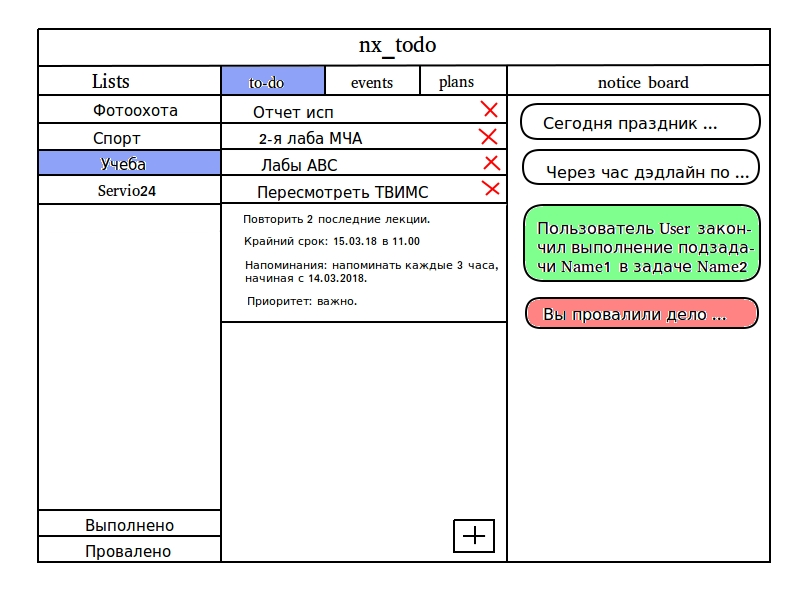
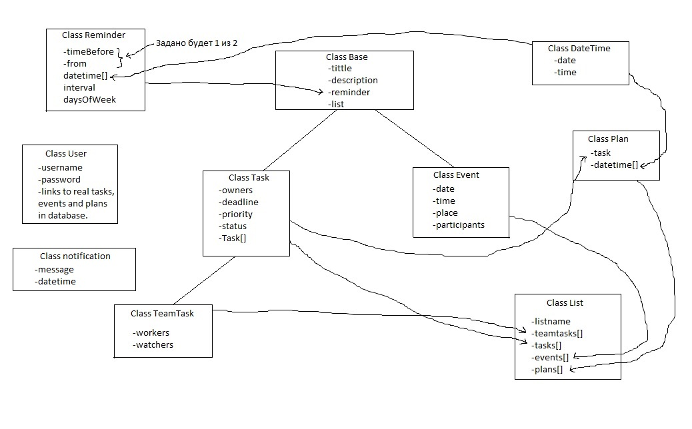
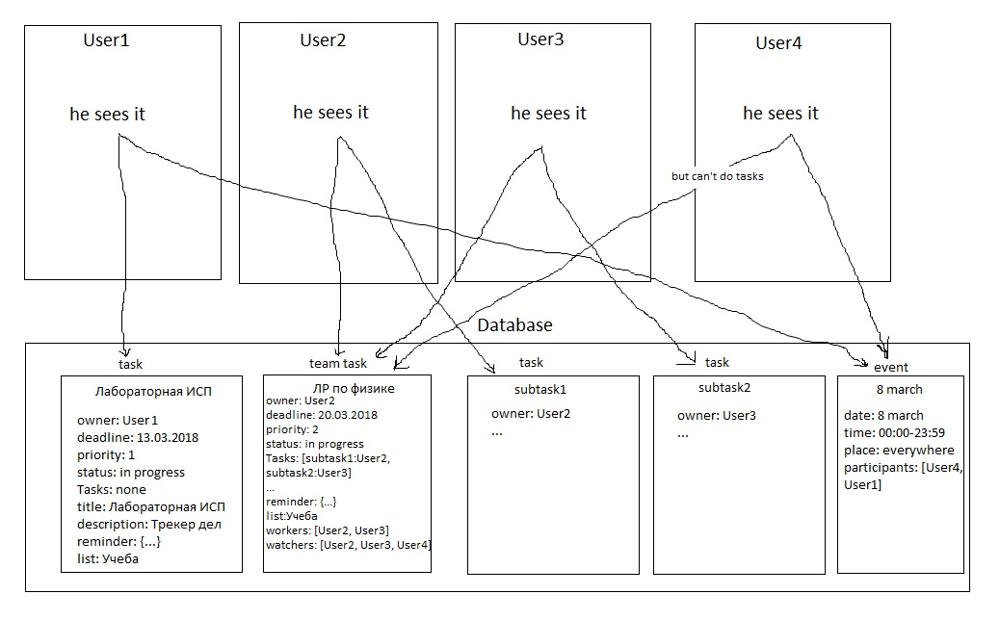

#Отчет о разработке трекера дел nx_todo
+ ## Аналоги
    В этом разделе рассмотрим существующие аналоги со стороны обывателя, для того, чтобы понять, какие вещи будут полезны, а каких лучше избежать.
    
    + ### Списки дел

        В основном предназначены для ведения некоторого списка личных задач с дополнительным пометками: важность, ограничение по времени, примечания, сроки и т.п.

        + #### Wunderlist
        
            *Плюсы:*
            
            1. На русском языке.
            2. Красивый и удобный интерфейс.
            3. Задача добавляется **в несколько кликов**, затем, при желании, ее можно дополнить доп. информацией (подзадачи, напоминания, прикерпленные файлы и др.).
            4. **Разделение задач на списки** (самые популярные предлогаются при первом входе, также пользователь может создавать свои).
            5. Разделение списков задач **между несколькими пользователями**.
            6. Возможность **пометить задачу как важную**.
            7. Есть как веб-версия, так и под десктоп, а также для смартфонов (при этом данные синхронизируются между устройствами).
            8. Пользователь может настроить фон, при этом цвета остального интерфейса подбираются под цвет фона.
            9. Звуковые сигналы. 
            
            *Минусы:*
            
            1. Существует платная версия. Однако она [не сильно](https://www.wunderlist.com/ru/pro/) ограничивает функционал.
            2. Нельзя задать интервал между напоминаниями (кроме как день, неделя, месяц и тд.).
      
        + #### Todoist
    
            *Плюсы, которые я не заметил в Wunderlist:*
            
            1. Разделение задач на приоритеты и каждый приоритет выделяется **своим цветом**.
            2. Понравилось то, что пользователь может посмотреть количество **выполненных** задач за определенное время (жаль, что сами задачи только лишь в премиум версии).
            3. Разделение пользователей на уровни. Для повышения уровня, нужно выполнить определенное кол-во задач, что, возможно, подталкивает пользователей к работе.
    
            *Минусы:*

            1. У приложения есть один большой минус - значительная часть функционала вынесена в премиум версию. Даже такие возможности как комментарии, напоминания и прикрепление файлов недоступны в бесплатной версии.

        + #### Ticktick

            *Плюсы:*

            1. По-моему, все хорошие качества Wunderlist и Todoist Ticktick вобрал в себя. Безусловно, на такое приложение стоит равняться.

            *Минусы:*

            1. Отсутствие подзадач.

    + ### Календари

        Позволяют установить события, связанные с определенными промежутками времени.

        + ####  Яндекс.Календарь

            *Плюсы:*

            1. Красивый и понятный интерфейс.
            2. **Разделение на календари** (можно создать несколько календарей, и при переключении между ними, события одного календаря не видны в другом).
            3. Возможность выбора, что показывать: день, неделю или месяц.
            4. Одно событие на несколько участников.
            5. Можно сказать, как мы хотим получать уведомления (по почте, смс, CalDav) или вовсе их отключить.
            6. Возможность создать событие, кликнув по тому месту календаря, где нам это нужно.
            7. Возможность создавать дела как в списках дел.
            8. Управление доступом для участников (изменять событие, приглашать других).
            9. Интегрирован с интегрирован с сервисами Яндекс.Почта, Яндекс.Карты, Яндекс.Афиша, Яндекс.Телепрограмма.

            *Минусы:*

            1. По умолчанию, пользователь видит календарь на неделю (это можно изменить в настройках). В этом режиме, мне кажется, выбран не очень удачный масштаб времени (каждый час), приходиться долго листать вниз, при этом поле постоянно "шатается" влево-вправо. 
            2. Для того, чтобы просмотреть все события, нужно, как я понял, просматривать все даты в календаре. То есть нельзя просмотреть такой список как "Все события за ...", а также отсутствует поиск по событию.

        + #### Google Calendar

            *Плюсы:*
            
            Из того, что не было названо в Яндекс.Календарь:

            1. Более гибкая настройка отображения календаря (можно выбрать: 4 дня, год, расписание). Расписание - это как раз тот режим, когда мы **видим все события**.
            2. Когда мы выбираем время события, его можно задать не вводя данные в поля ввода, а просто провести курсором на временной шкале.
            3. Есть приложение для смартфона.

    + ### Трекеры задач

        В общем виде служат для отслеживания выполнения задач в группах людей с иерархической системой управления.

+ ## Сценарии использования

    Приложение nx_todo можно будет применять для решения следующих примеров из жизни:

    + Лабораторная работа 13 числа, нужно создать задачу и получать уведомления 2 раза в день, начиная с 10 числа.
    + Для того, чтобы не забыть отправить данные в удаленный репозиторий, 13 числа в 23:00 должно появиться уведомление о событии.
    + Студент учится на военной кафедре, часто бывает так, что он забывает побриться и подшиться в воскресенье вечером. Нужно, чтобы каждое воскресенье утром создавалась соответствующая задача, помеченная как важная.
    + Для того, чтобы не забыть поздравить дам с праздником, весь день 8 марта должно висеть уведомление об этом.
    + Получена лабораторная работа по физике. Группа делится на несколько бригад, на одну бригаду есть задача. Так сложилось, что участники бригады не смогут встретиться для очного выполнения работы. Староста бригады создает задачу, ставит подзадачи и дэдлайн для нее и включает остальных в участники. Каждый участник, когда заходит со своей учетной записи, видит новую задачу и выполняет ее.

+ ## Планируемые возможности

    Здесь описан полный функционал приложения, с помощью которого будут выполняться сценарии использования.

    + ### Возможность создать задачу.

        Для этого:
        
        + Быстрое добавление.

            Пользователь вводит только текст задачи.

        + Расширенное добавление.
        
            Поьзователь может ввести дату дэдлайна, установить приоритет, настроить напоминания (интервалы, в каком промежутке времени), создать подзадачи, задать пользователей с доступом к выполнению подзадач или без разрешения на выполнение, а только на просмотр задачи.

    + ### Возможность создать событие.

        Для этого:
        
        + Пользователь в поле ввода пишет название события.
        + В другое поле ввода можно ввести описание.
        + Устанавливается интервал времени, в течение которого уведомление о событии будет существовать.
        + Добавляется круг пользователей, приглашенных на событие.

    + ### Возможность создать план.

        Для этого:
        
        + Используется механизм создания задачи.
        + Устанавливаются даты. Например, каждое 1 число месяца, каждый понедельник, или просто задаются определенные даты и время.

    + ### Возможность создать список (список может содержать все описанное выше: задачи, события, и планы).

        Для этого пользователь вводит название списка. Список потом будет хранить в себе задачи, события и планы.
   

+ ## Логическая архитектура

    Для того, чтобы было проще продумывать логическую архитектуру, был нарисован шаблон интерфейса.
    
    

    *На следующем рисунке представлены основные сущности приложения.*

    

    Сущность Reminder хранит в себе все данные о напоминаниях:
    
    + timeBefore или from задают момент времени, с которого можно показывать напоминания.
    + datetime[] - список точных дат, когда нужно будет показать напоминание.
    + interval - промежуток между напоминаниями.
    + daysOfWeek - дни недели, в которые нужно показывать напоминания.

    *На этом рисунке схематично показаны некоторые примеры взаимодействия пользователей и базы данных.*

    

    У каждого пользователя будет набор "ссылок" (пока они просто будут как название задачи или события). При входе в приложение, используя эти ссылки, данные загружаются из базы данных и отображаются в пользовательском интерфейсе (в веб-версии). Используется такой принцип для того, чтобы один и тот же объект (задача, событие) могли быть разделены между сколь угодным кол-вом пользоватлей. Так же это удобно тогда, когда мы хотим создать задачу не для себя, а для другого пользователя, тогда мы просто при создании задачи ставим в owner не себя а того, кому адресована задача, а тому пользователю в ссылки добавляем созданную задачу. Тогда при загрузке приложения, наша задача появится в задачах того пользователя.  
    
    Так же это удобно будет при работе с TeamTask: у задачи в поле workers находится пользователь, соответсвенно он видит эту задачу в своих задачах и может начать работу над какой-либо подзадачей. Он выбирает подзадачу и ставит ей в поле owners себя, после этого он может отдельно работать с подзадачей, а подзадача в TeamTask будет отмечена как "разрабатывается пользователем user".

+ ## Этапы разработки

    + *Прототип*  
    
        Будет скрипт, в котором реализованы основные классы, такие как Base, Task, Event, Reminder, Notification. Данные будут храниться в обычном текстовом файле в формате JSON. Приложение будет работать в консольном режиме. Задача прототипа - положить основу и протестировать написанные базовые классы.
        
    + *Базовая версия*

        В базовой версии планируется использование базы данных и реалзация всех классов.

    + *Веб-версия*

        Будет сверстана страничка приложения. Логика из базовой версии связана с пользовательским интерфейсом.
    
+ ## Сроки
    + до 31 марта - прототип.
    + до 31 апреля - базовая версия.
    + до 31 мая - веб-версиия.
+ ## Статус

    Написан отчет о разработке.
